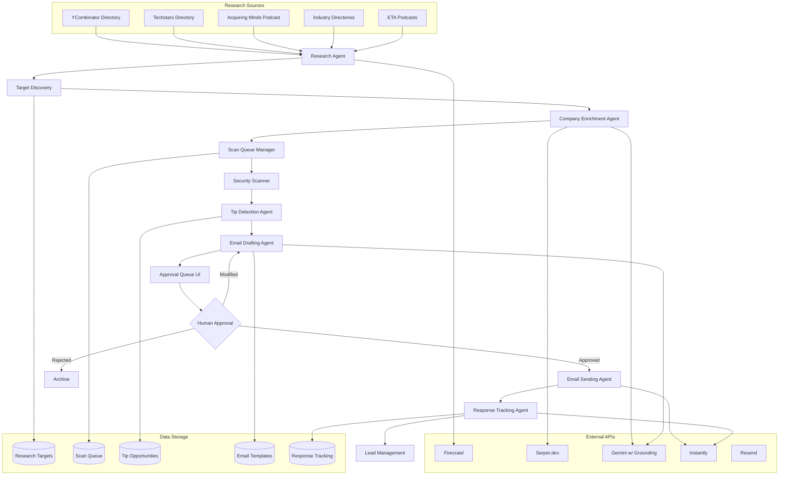

# Outbound Agent System - Product Requirements Document

## Overview

The Outbound Agent System is an end-to-end automated business development pipeline that discovers high-value security prospects, scans them for vulnerabilities, detects threat intelligence opportunities, and generates personalized outreach emails. The system operates as a "threat intelligence tip-off" program where we notify companies of active security threats discovered during research for other clients.

## System Architecture

## Core Components

### 1. Research Agent
**Purpose**: Automatically discover high-value target companies from multiple sources

**Data Sources**:
- YCombinator companies (last 2 years: W22, S22, W23, S23, W24, S24)
- Techstars portfolio companies (last 2 years)
- Acquiring Minds podcast guests
- Entrepreneurship Through Acquisition podcast guests
- Industry verticals: HVAC, plumbing, ecommerce, healthcare, dental, legal, accounting
- Small business directories via Google Places/Yelp APIs

**Discovery Methods**:
- Web scraping with Firecrawl for structured data extraction
- Search API queries via Serper.dev for recent company information
- Podcast transcript analysis via Gemini for guest company extraction
- Industry directory crawling for small business targets

**Output**: Prioritized list of target companies with basic metadata

### 2. Company Enrichment Agent
**Purpose**: Enhance target company data with detailed business intelligence

**Enrichment Process**:
- Company size and employee count estimation
- Technology stack detection
- Industry classification and compliance requirements
- Security budget estimation based on company profile
- Contact discovery (CISO, CTO, IT Director, security team emails)
- Recent news and funding information via search + AI analysis

**Data Sources**:
- Instantly's 450M+ B2B database for contact enrichment
- Firecrawl for website analysis and technology detection
- Serper.dev + Gemini for news analysis and company intelligence
- WHOIS data for domain ownership and hosting information

**Output**: Fully enriched company profiles with contact information and targeting scores

### 3. Scan Queue Manager
**Purpose**: Intelligently prioritize and schedule security scans based on target value

**Prioritization Logic**:
- Company size and estimated security budget
- Industry attack surface risk (healthcare = high, HVAC = medium)
- Funding status and growth stage (funded startups = high priority)
- Previous scan recency (avoid duplicate scans within 30 days)
- Source credibility (YC companies > directory listings)

**Queue Management**:
- Batch processing to avoid overwhelming scan infrastructure
- Rate limiting to respect external API quotas
- Retry logic for failed scans with exponential backoff
- Load balancing across available scan workers

**Output**: Optimized scan schedule with resource allocation

### 4. Tip Detection Agent
**Purpose**: Analyze completed scan results to identify viable tip opportunities

**Detection Criteria**:

**High-Value Tips (Priority 1)**:
- Infostealer credential exposures (>5 accounts or executive accounts)
- Active phishing sites with login forms and high threat scores
- Critical infrastructure exposures with public exploitation potential

**Medium-Value Tips (Priority 2)**:
- Smaller credential exposures (2-5 accounts)
- Typosquats with email capability and suspicious registrars
- Significant SSL/TLS vulnerabilities on customer-facing services

**Low-Value Tips (Priority 3)**:
- Single credential exposures
- Certificate anomalies suggesting preparation for attacks
- Configuration issues with security implications

**Exclusion Rules**:
- Skip findings older than 6 months unless recently discovered
- Exclude technical issues without clear business impact
- Filter out false positives using confidence scoring

**Output**: Scored tip opportunities with supporting evidence and business impact assessment

### 5. Email Drafting Agent
**Purpose**: Generate personalized, professional threat intelligence notifications

**Template Categories**:
- Infostealer credential exposures
- Active phishing threat notifications
- Certificate/domain security alerts
- General security intelligence tips

**Personalization Elements**:
- Company name, industry, and size-appropriate language
- Specific threat details with technical accuracy
- Business impact framing relevant to company type
- Contact name and title when available
- Recent company news or funding for context

**Tone Requirements**:
- Professional, non-salesy, genuinely helpful
- Technical accuracy without overwhelming jargon
- Clear urgency without fear-mongering
- Positioned as "courtesy notification during research"

**Output**: Draft emails with subject lines, personalized content, and confidence scores

### 6. Approval Queue UI
**Purpose**: Provide efficient human review and approval interface for email campaigns

**Dashboard Features**:
- Priority-sorted tip queue with severity indicators
- Company information panel with enrichment data
- Threat details with technical evidence
- Email preview with inline editing capabilities
- Bulk approval actions for high-confidence tips
- Analytics on approval rates and conversion metrics

**Review Interface**:
- Side-by-side view of company data and email draft
- One-click approve/reject/modify actions
- Template override capabilities for edge cases
- Scheduling options for optimal send times
- Unsubscribe and compliance management

**Output**: Approved emails ready for delivery with any human modifications

### 7. Email Sending Agent
**Purpose**: Deliver approved emails with tracking and deliverability optimization

**Sending Logic**:
- Optimal timing based on recipient timezone and industry
- Rate limiting to avoid spam filters and maintain sender reputation
- A/B testing of subject lines and email templates
- Fallback delivery methods for improved deliverability

**Tracking Implementation**:
- Email open tracking with pixel beacons
- Link click tracking for engagement measurement
- Reply detection and categorization
- Bounce and unsubscribe handling

**Deliverability Features**:
- Domain authentication (SPF, DKIM, DMARC)
- Sender reputation monitoring
- List hygiene and bounce management
- Compliance with CAN-SPAM and GDPR

**Output**: Delivered emails with comprehensive tracking data

### 8. Response Tracking Agent
**Purpose**: Monitor email engagement and identify sales opportunities

**Tracking Metrics**:
- Email open rates and timing
- Link click behavior and interest indicators
- Reply sentiment analysis and categorization
- Meeting request detection and scheduling coordination

**Lead Qualification**:
- Response quality scoring (interested vs. polite rejection)
- Budget and authority indicators from replies
- Timeline and urgency signals
- Technical sophistication assessment

**CRM Integration**:
- Lead creation for positive responses
- Activity logging for follow-up coordination
- Pipeline stage management
- ROI tracking from initial tip to closed deal

**Output**: Qualified leads with engagement history and next action recommendations

## Technical Requirements

### Infrastructure
- **Hosting**: Fly.io for agent workers (dedicated machine for reliability)
- **Database**: Supabase for all data storage with real-time subscriptions
- **Caching**: Redis for API response caching and rate limiting
- **Monitoring**: Sentry for error tracking, PostHog for analytics

### External APIs
- **Instantly**: Contact enrichment, email verification, and sending
- **Firecrawl**: Reliable web scraping with structured data extraction
- **Serper.dev**: Search API for company research and news gathering
- **Gemini with Grounding**: AI analysis of company data and content generation
- **Resend**: Backup email delivery for system notifications

### Data Storage Schema
- **research_targets**: Company discovery and enrichment data
- **scan_queue**: Scan prioritization and scheduling
- **tip_opportunities**: Detected threats and email drafts
- **email_templates**: Template library with personalization variables
- **response_tracking**: Email engagement and lead qualification data

### Security & Compliance
- **Data Protection**: Encryption at rest and in transit for all contact data
- **Email Compliance**: CAN-SPAM and GDPR compliance with unsubscribe handling
- **API Security**: Rate limiting, authentication, and abuse prevention
- **Audit Logging**: Complete activity trail for compliance and debugging

## Success Metrics

### Discovery Metrics
- Targets discovered per day/week
- Source effectiveness (conversion rate by source)
- Enrichment success rate and data quality scores

### Scan Metrics
- Scans completed per day
- Tip detection rate (tips per scan)
- Scan quality score based on finding accuracy

### Email Metrics
- Email delivery rate and deliverability score
- Open rates by industry and company size
- Reply rates and positive response percentage
- Time from tip detection to email sent

### Business Metrics
- Lead generation rate (qualified leads per month)
- Cost per lead across the entire pipeline
- Revenue attribution from tip-generated leads
- ROI on system development and operational costs

## Implementation Phases

### Phase 1: Core Pipeline (Weeks 1-2)
- Research agent with YC/Techstars discovery
- Basic company enrichment via Instantly
- Tip detection for infostealer exposures
- Simple approval UI with email editor
- Email sending via Instantly with basic tracking

### Phase 2: Intelligence Enhancement (Weeks 3-4)
- Advanced company research with Serper + Gemini
- Expanded tip detection (phishing, certificates)
- Template system with personalization
- Response tracking and basic analytics
- Industry directory crawling

### Phase 3: Optimization & Scale (Weeks 5-6)
- Podcast guest discovery and analysis
- Advanced targeting and prioritization algorithms
- A/B testing framework for email optimization
- Comprehensive analytics dashboard
- Lead qualification and CRM integration

### Phase 4: Advanced Features (Weeks 7-8)
- Automated follow-up sequences
- Advanced personalization with news integration
- Predictive lead scoring
- Integration with existing sales processes
- Performance optimization and cost reduction

## Risk Mitigation

### Technical Risks
- **API Rate Limits**: Implement caching, batching, and fallback providers
- **Data Quality**: Multiple validation layers and confidence scoring
- **Scalability**: Horizontal scaling with load balancing and queue management

### Business Risks
- **Spam Reputation**: Careful list hygiene, authentication, and sending practices
- **Legal Compliance**: Built-in GDPR and CAN-SPAM compliance features
- **False Positives**: Human approval requirement and quality scoring

### Operational Risks
- **Cost Overruns**: Usage monitoring and budget alerts for external APIs
- **Maintenance Overhead**: Automated health checks and error recovery
- **Data Security**: Encryption, access controls, and audit logging

## Success Criteria

The system is considered successful when it achieves:
- 100+ qualified tips generated per month
- 15%+ email open rate across all campaigns
- 3%+ positive reply rate indicating genuine interest
- 5+ sales meetings booked per month from tip outreach
- <$50 cost per qualified lead including all operational expenses
- 90%+ system uptime with automated error recovery